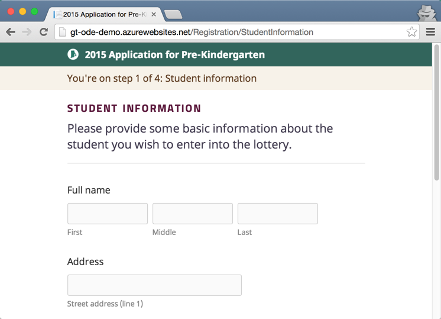
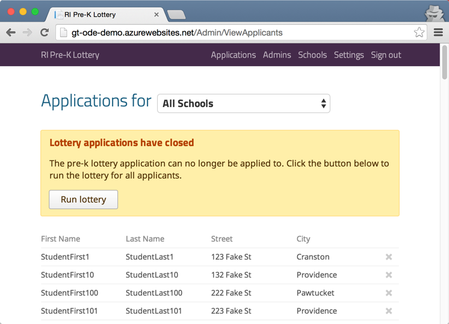
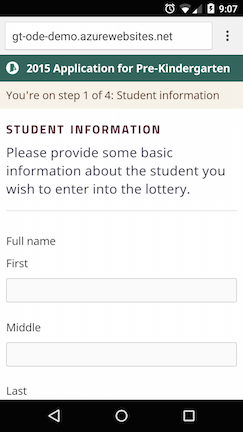

# 

Golden Ticket is a web application that allows:

- Parents to register their child for school lotteries online (in English or Spanish)
- Administrators to conduct a randomized lottery, weighted by income and gender
- Administrators to easily notify parents of lottery results via email

The project was developed as a joint effort between the Rhode Island Department of Education (RIDE), Code for America, and the RI State Office of Digital Excellence (DOA). It is free to use or adapt for anyone or any organization wishing to do so.

### Parent screen

### Admin screen

### Parent screen (mobile view)

## Getting Started

All documentation can be viewed in the `docs` folder.

### User

- [**Parent Screens**](docs/Parent Screens.md): Visual tour through the screens that parents fill out.
- [**Admin User Guide**](docs/Admin User Guide.md): Instructions on how an administrator can use the application to conduct a lottery.
- [**First Time Admin Setup**](docs/First Time Admin Setup.md): What an admin needs to do the first time they login to the system. 

### Developer / Technical Operations

- [**Developer Setup**](docs/Developer Setup.md): If you're a coder and want to hack on the application (maybe add a feature or fix a bug?), this is a good place to start.
- [**Loading Test Data**](docs/Loading Test Data.md): How to load test data into a local dev system. Includes schools, applicants, and a default configuration.
- [**Deployment**](docs/Deployment.md): Information about configuring the application to be run on a server.
- [**Run Local Email Server**](docs/Run Local Email Server.md): The application sends email notifications and this says how to test that functionality locally as a developer.

## How to contribute

The project maintains an active issues list, both for bug tracking and enhancements. The 'Backlog' milestone contains features that would be great to have.

Any code contributions should be submitted as pull requests. Pull requests will be reviewed by @dariyam. 

Bugs should be submitted as issues and labeled as `bug`. Feature requests should be submitted as issues and labeled as `enhancement`. Inquiries should be submitted as issues and labeled as `question`.

## Credits

The following teams made this application possible.

### Rhode Island Department of Education (RIDE)

The [Early Childhood Education team](http://www.ride.ri.gov/InstructionAssessment/EarlyChildhoodEducation.aspx) -- consisting of Kristen Greene (@kristengreene), Franklin Brito (@FranklinBrito), Sara Mickelson (@micksara), and Michelle Palermo -- are devoted to increasing access to pre-kindergarten to as many children as possible. They were instrumental in the design of the application and came up with the original idea to computerize the process for the benefit of everyone involved.

The [Office of Network and Information Systems](http://www.ride.ri.gov/InsideRIDE/RIDEOffices/NetworkInformationSystems.aspx) (led by Ed Giroux) uses technology everyday to make life easier for educators. Developer Derick Ariyam (@dariyam) has helped guide the team around technical constraints and deployment. He'll be supporting Early Childhood Education with the app in 2015 and keeping a lookout for pull requests.

### RI Office of Digital Excellence (ODE)

The [RI State Office of Digital Excellence](https://twitter.com/ri_ode) is responsible for making RI more efficient, accessible, and transparent through the use of technology and improved services. Chief Digital Officer Thom Guertin (@thomguertin) connected Code for America with RIDE, and advised the team during its development. While no longer with ODE, Mark Giansanti helped during the requirements phase of the project.

### Code for America

[Code for America](http://www.codeforamerica.org) is a non-profit that helps to make government more transparent and user friendly through digital services. Jeff Maher (@plusjeff) did project management and development for the application, and Andrew Maier (@andrewmaier) designed the user experience and made it look awesome (and with responsive design too!). Anna-Marie Panlilio (@codesliced) etched the project logo.

### Penn State Abington

With the project having education at its core, it seemed like a no brainer to have students become involved in the future development of the application. It was  Professor Karl Pietrzak's (@The-Alchemist) brilliant idea to get computer science students at PSU Abington to help contribute features to the application in 2015 and beyond.

## Project History

The project began as a way to conduct the Rhode Island Pre-K Lottery process for the Rhode Island Department of Education's (RIDE) Early Childhood Education program.

The project has been conducted in three phases, based on time constraints.

### Phase 1

Created a Google Form to collect electronic registrations that were saved to a Google Spreadsheet. The team created a [tool to separate the registrations by school](http://github.com/codeforamerica/golden-ticket-splitter) to help RIDE conduct metrics gathering during the registration process.

Learning: Registrations went up 27% compared to the paper process in 2013.

### Phase 2

Using the registrations collected in Phase 1, the team created a [tool to perform the lottery selection process](http://github.com/codeforamerica/golden-ticket-console) using data from the Google Spreadsheet/CSV. It not only would created selected and waitlisted CSVs, but also intermediary CSVs showing different steps in the lottery selection process (done for accountability).

Learning: The lottery selection process ran on 1000 registrations in about 2 seconds. This saved RIDE and school administrators a day or two of work performing the process manually.

### Phase 3

**This** project is phase 3. In place of a Google Form and a command line tool, the application will cover the process end-to-end in the form of a web app. This phase of the application will be used in the 2015-2016 RI Pre-K lottery and will hopefully play a part in enabling RI State to offer more Pre-K programs.