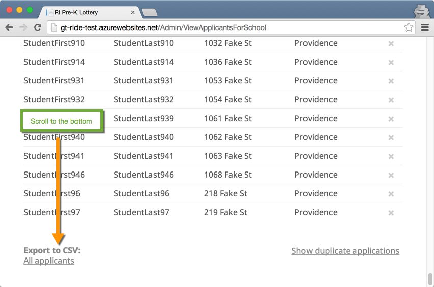
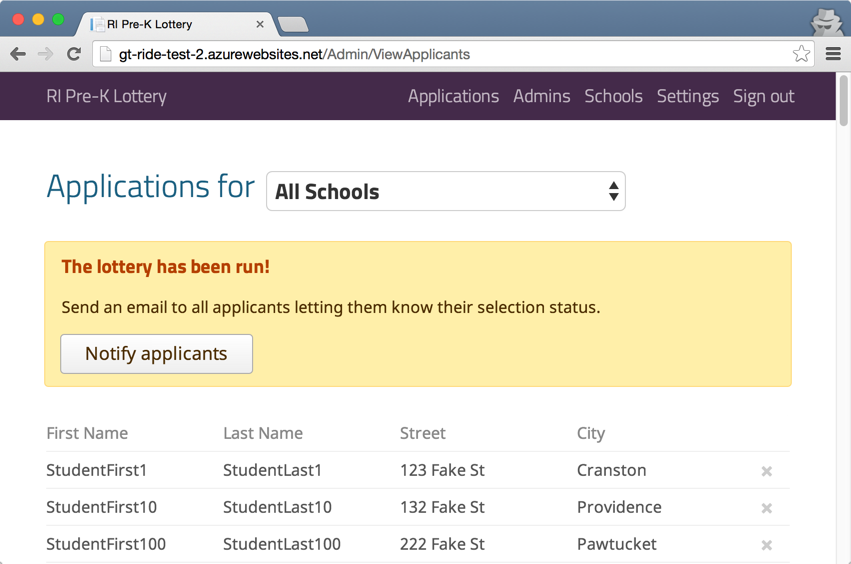

# Admin User Guide

You're a lottery administrator and your IT department did their awesome thing and put up Golden Ticket for you! Now what? Read on..

## Provided Features

Golden Ticket allows an administrator to do the following things:

- View applicants for a lottery (all together or per school)
- See possible duplicate applicants
- Edit or delete applicants
- Add, edit, configure, and remove schools that applicants can apply to
- Run a randomized lottery weighted by income and gender
- Add or remove administrators
- Send notification emails to applicants saying if they were selected or waitlisted

## Applications

### Viewing

There are several ways to view applicants.

All of them:

100 applicants appear on each page, ordered in ascending order by last name. Pages can be moved between using the navigation at the bottom.

Just for a single school:

Additionally, you can export the list of applicants too:

or similarly just applicants for an individual school.

Lastly, you can view potential duplicate applicants. This display is for all schools, regardless of which `Applications` screen you come follow the link from.

Applicants are identified as possible duplicates when last name, city, and birthday are the same.

### Editing / Deleting

From any applicant list, you can click on an applicant, then view and edit their information (including deleting).

You can also delete applicants from the list itself, still getting a confirmation screen before it happens.

## Admins

You can view and delete admins from the `Admins` tab (surprise, eh!? :-P). It's pretty straight forward. 

Create a new admin with the `Add a new admin` button and delete an existing one with the corresponding `Delete` link. The currently logged in admin cannot be deleted (an admin can only be deleted from another admin's account).

If you create an admin with the wrong email address, there's no edit admin functionality. Just delete the wrong one and create a new one.

To change a password, Sign off and on the login screen, use the Forgot Password prompts to change the password.

## Schools

You've guessed it - schools can be added, edited, and removed from the schools view.

Most of the fields for a school are self explanatory, but there are a few that are very relevant to the way the lottery will select applicants.

- **Seats**: This is the number of open seats, or the number of applicants that can be selected, for the school. For the school, this many students will be chosen and all others will be waitlisted.
- **Percentage of students to accept below the poverty line**: This is the proportion of students that should be chosen below the poverty become selecting students above the poverty line. In RI when the software was created, this corresponded to federal guidelines.
- **Percentage of students to be male**: This is to help with gender balance during selection.

It should be said that income is given higher precedence than gender in the lottery selection process.

## Settings

These are settings for display and help control the application and lottery behaviors.

There are several sections:

### Application Period

- **Open date**: This is when the lottery is open for registration. Disclaimer: This setting is not actively used anywhere in the application at the moment. It's expected that the application will taken offline until the lottery period actually opens.
- **Close date**: This is when registration for the lottery is closed. When parents arrive at the site after this date, they will be allowed to register. Additionally, when admins login, they will be given the ability to run the lottery from the `Applications` section (on the `All schools` page)

### Notification Date

This is used to tell parents when they should expect to hear about the lottery results, either from the administrators or the schools themselves. A notification email is not automatically generated when this date is hit (rather, notifications can be sent immediately after the lottery runs).

### Lottery Contact Person

This is an administrator that can be contacted if there are any questions.

### Poverty Criteria

This table has the number of household members in the first column and a dollar amount in the second column. You can think of this as a poverty line determinant table.

For example, if the table has `3 ----- 2425`, this means that an applicant with 3 household members is below the poverty line if the household's combined income makes $2425 or less each month (on average).

The table is populated for up to 10 household members, but after that, a multiplier is applied to each additional household member. For example, the poverty line is drawn for a household of 12 in the following way:

Poverty line = (10 household member limit) + (household members-10)*multiplier

### Reset Lottery

This removes all applicants and resets that the lottery has not been run.

## Running the Lottery

After the close date (see: Settings) has passed, the `Run Lottery` button becomes available on the Applications screen for All Schools. 

Before running the lottery, you may want to clear out any duplicate applications first. The current implementation of the lottery takes about one to five minutes to run on 1000 applicants (on faster machines, it's under a minute), so be patient and don't refresh.

After the lottery is complete, going to the Applications page for each school will reveal `Selected` and `Waitlisted` sections on each page.

Each school also has the following CSV export functions available post-lottery run:

- **All applicants**: All the applicants who applied, in ascending order by last name. These is the pre-lottery run list.
- **Shuffled applicants**: All the applicants who applied, in a randomly shuffled order used at the beginning of the lottery run. This can be used to manually run the lottery if an accountability audit needs to be run.
- **Selected applicants**: All the applicants selected for the school by the lottery.
- **Waitlisted applicants**: All the applicants not selected for the school by the lottery.

Additionally, after the lottery is completed an admin can send email notifications to all applicants. The email will be delivered in the language that the application was filled out by the parent.

