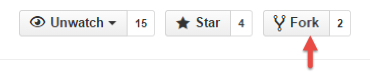
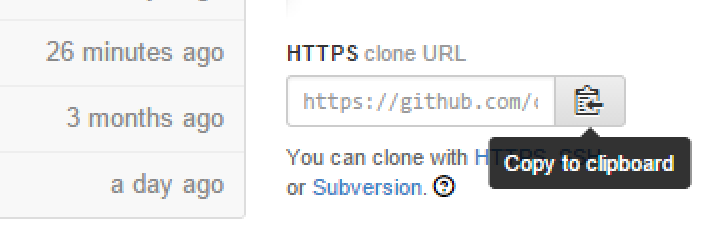
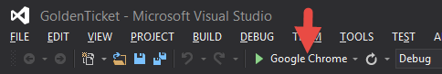

# Developer Setup

Want to work on code for Golden Ticket? Awesome! Here's how to get started based on your environment.

## Visual Studio 2013 / Windows

### Requirements

- Visual Studio 2013 (either Ultimate or Express for Web)
- A Git client ([Visual Studio can do this](http://msdn.microsoft.com/en-us/library/hh850437.aspx), but other clients include [SourceTree](http://www.sourcetreeapp.com/), [GitHub client](https://windows.github.com/), or the [Command Prompt](http://git-scm.com/).

### Get the code

1. Go to the [Golden Ticket GitHub](http://github.com/codeforamerica/golden-ticket) page
1. Fork the project and then go to the fork's GitHub page

1. Copy the clone URL

1. Use your Git client to clone the project

### Open in Visual Studio

From the directory that your project was cloned in, double click the `GoldenTicket.sln` file to open it in Visual Studio.

### Load the Web Application

After the project is open in Visual Studio, click the Play button to start the application server. 

The application should launch in your web browser. The below URLs are the important ones

- `/`: The parent side of the application
- `/Admin`: The administrator side of the application

## Xamarin Studio with Mono Framework / Mac, Linux, Windows

There are currently some bugs in the Mono Framework that prevent the project from being loaded.

- [Bug 21810 - Method not implemented System.Web.HttpApplication.RegisterModule](https://bugzilla.xamarin.com/show_bug.cgi?id=21810)
- [Bug 23754 - System.Web.Entity assembly missing from Mono for .NET 4.5](https://bugzilla.xamarin.com/show_bug.cgi?id=23754)

After these are resolved or if anyone has any luck loading the project, please update this document.