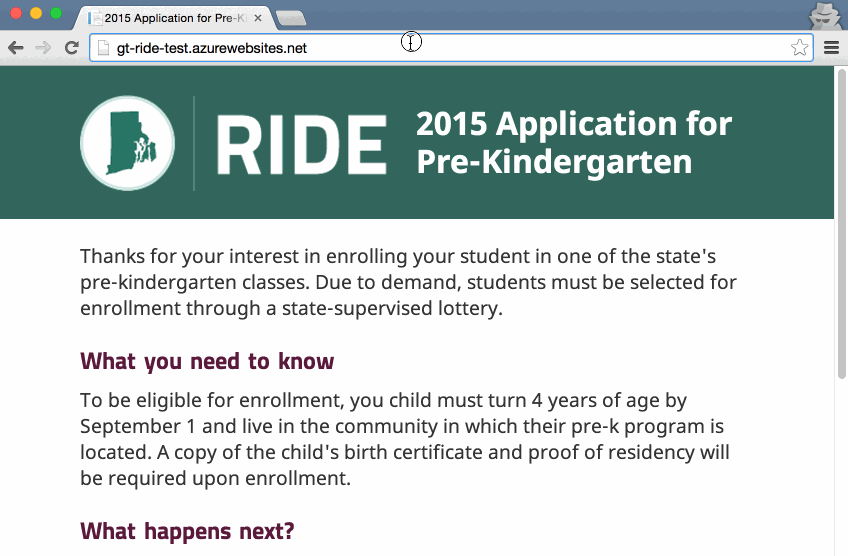

# First Time Admin Setup

The first time the application is installed and run, it is configured with a default admin user. To make the system secure, please perform the following steps to create your own admin account and remove the default one.

## Steps

1. Start the application
2. Go to the `/Admin` URL
3. Login with email `admin@admin.edu` and password `passwordGT1@`
4. Go to the `Administrators` tab
5. Add a new administrator account with your own email and password
6. Click the `Sign out` link
7. Login with your new account
8. Go to the `Administrators` tab
9. Delete the `admin@admin.edu` account

## Demo

