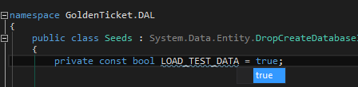
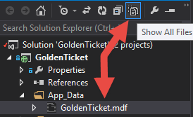
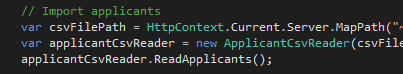

# Loading Test Data

Golden Ticket comes with sample data that can be loaded to test the system. This describes where the data lives and how to load it.

## Configuration

### What is it?

- Default lottery open date
- Default lottery close date
- Default lottery notification date
- Default poverty line incomes (based on 2014 federal guidelines)
- Default contact person
- Default contact email
- Default contact phone

This data can be found in `GoldenTicket/DAL/Seeds.cs` under the `Configurations` comment.

### How to load it?

 This data is *always* loaded and nothing needs to be configured to trigger it.

## Schools

### What is it?

There is a set of schools that can be loaded, which includes all of the participating schools from the 2014 Rhode Island lottery.

This data can be found in `GoldenTicket/DAL/Seeds.cs` under the `Configurations` comment.

### How to load it?

From `GoldenTicket/DAL/Seeds.cs`, look for the `LOAD_TEST_DATA` variable. Switch the value to `true`.

Then, delete `GoldenTicket/App_Data/GoldenTicket.mdf` if the file exists (in Visual Studio, this file will only display if **all files** are visible).

Start the application and navigate to an admin page (`/Admin`), and the data will be loaded.

## Applicants

### What is it?

This is the 2014 Rhode Island applicant data, but with personally identifiable information removed. This allows the system to be populated with about 1000 applicant records, including two duplicate records.

This data is stored in `GoldenTicket/TestData/data.csv`.

### How to load it?

The mechanism to load it is the same as the school data (see instructions above) and gets loaded at the same time.

If you want to load schools *without* loading applicants, comment out the `Import applicants` block in the `GoldenTicket/DAL/Seeds.cs` file.

 