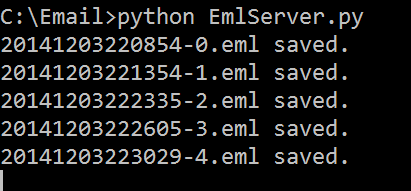
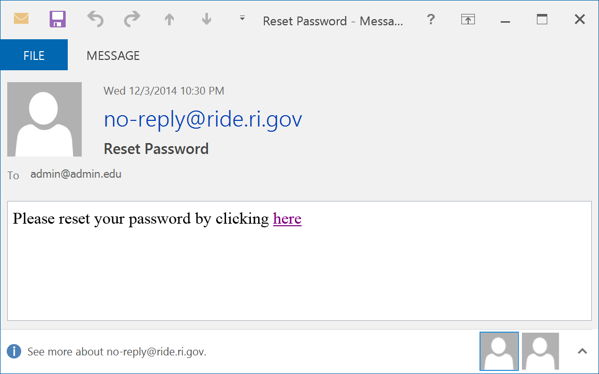

# Run Local Email Server

If you want to test password resets or email notifications to parents, you need to have an email server setup. While you can edit the mail `appSettings` configuration fields, you can also use the default configuration and run a local email server (i.e. running on `localhost` at port `25`).

This document shows an easy way to do this with a simple Python script that can run from the command prompt and whenever an email is sent, it drops the contents into a file in the same directory it is run.

## Requirements

- Python 3.x (This can be downloaded from [Python.org](http://python.org)
- Python to be on your system `PATH` variable

## Python Script

Take the below script and paste it in a text file. For example's sake, I'll name the file `EmlServer.py`.

	from datetime import datetime
	import asyncore
	from smtpd import SMTPServer

	class EmlServer(SMTPServer):
	    no = 0
	    def process_message(self, peer, mailfrom, rcpttos, data):
	        filename = '%s-%d.eml' % (datetime.now().strftime('%Y%m%d%H%M%S'),
	                self.no)
	        f = open(filename, 'w')
	        f.write(data)
	        f.close
	        print('%s saved.' % filename)
	        self.no += 1
	
	
	def run():
	    foo = EmlServer(('localhost', 25), None)
	    try:
	        asyncore.loop()
	    except KeyboardInterrupt:
	        pass
	
	
	if __name__ == '__main__':
		run()

Place the file in an empty directory that doesn't require admin rights to create files in. (In the example, I've created `C:\Email`.)

## Run the Python Script

`python EmlyServer.py`

Whenever an email is received by the script, it'll write the following out to the command prompt:

`yyymmddhhmmss-#.eml saved.`

## View the Emails

The messages can be opened in either a plain text editor or in an email client such as Outlook or Thunderbird. An email client is recommended so that formatting can be viewed accurately.

## Alternate Method

If you want to use with a different email server, simply edit the `Web.config` file and update the following settings according under the `appSettings` section:

    <add key="SmtpAddress" value="localhost"/>
    <add key="SmtpPort" value="25"/>
    <add key="SmtpUsername" value=""/>
    <add key="SmtpPassword" value=""/>
    <add key="MailFrom" value="no-reply@ride.ri.gov"/>

